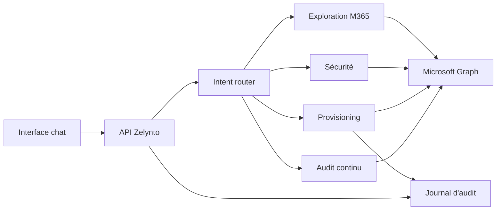

# Architecture

## Vue d'ensemble

Zelynto est organisé autour d'un orchestrateur de langage naturel qui transforme les prompts en intentions métier. Chaque intention est routée vers un service spécialisé.

## Modules

- `src/server.ts` expose l'API HTTP.
- `src/core/natural-language.ts` détecte les intentions MVP.
- `src/m365/graph-client.ts` encapsule Microsoft Graph.
- `src/features/exploration.ts` répond aux questions d'inventaire.
- `src/features/security.ts` synthétise les alertes.
- `src/features/provisioning.ts` prépare et exécute les actions.
- `src/features/audit.ts` calcule les écarts et recommandations.
- `src/web` contient l'interface conversationnelle.

## Passage en production

Les points à durcir avant une vraie mise en production :

- authentification utilisateur et consentement admin Entra ID ;
- permissions Graph minimales par fonctionnalité ;
- chiffrement des secrets ;
- journal d'audit append-only ;
- rate limiting et garde-fous sur actions sensibles ;
- mode lecture seule par défaut pour les nouveaux tenants ;
- mapping des règles d'audit sur CIS, ORCA et référentiels internes.
